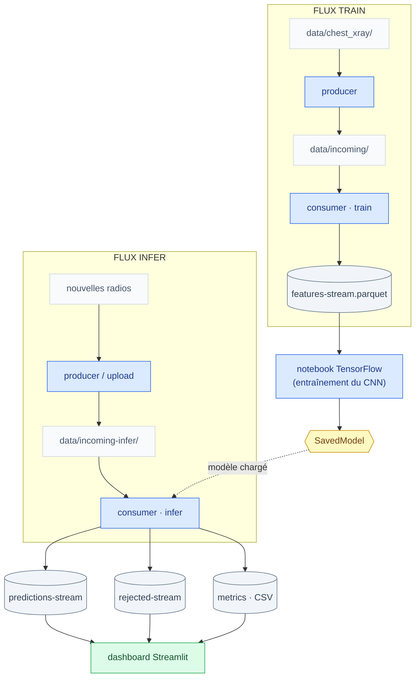

# X-Ray Pneumonia Detection

Pipeline de détection de pneumonie sur radiographies thoraciques, en temps réel.

Classification en 3 classes (`NORMAL`, `PNEUMONIA_BACTERIA`, `PNEUMONIA_VIRUS`),
construite sur **Spark Structured Streaming** (Scala) pour le traitement des
images en continu et **TensorFlow** (Python) pour le modèle. Un dashboard
Streamlit suit le flux en direct : prédictions, latence, débit.

## Fonctionnalités

- **Traitement en continu** : les radiographies déposées dans une landing zone
  sont vectorisées et prédites au fil de l'eau (micro-batches Structured Streaming).
- **Pattern producer-consumer** : un producer alimente la landing zone par lots
  cadencés ; des consumers résidents la surveillent.
- **Dépôt atomique** : staging invisible puis rename atomique — un fichier ne
  peut jamais être lu à moitié écrit.
- **Tolérance aux pannes** : checkpointing Spark ; un consumer interrompu reprend
  exactement où il s'était arrêté, sans doublon ni perte.
- **Quarantaine** : les fichiers illisibles sont isolés avec leur message
  d'erreur, le flux continue.
- **Vectorisation unique** : le même code transforme les images pour
  l'entraînement et pour l'inférence — aucun écart train/serving.
- **Stockage agnostique** : toutes les opérations I/O passent par l'API Hadoop FileSystem ;
  un dossier local ou un cluster HDFS, seule l'URI change.
- **Observabilité** : débit (images/s) et durée de chaque micro-batch exposés en
  console, en CSV et sur le dashboard.
- **Déploiement conteneurisé** : `docker compose up`  — consumer qui tourne en permanence
  et dashboard démarrent ensemble.
- **Entraînement TensorFlow** : le feature store produit par le flux d'entraînement
  alimente un notebook qui entraîne le CNN et exporte le SavedModel.

## Architecture



Deux services Scala, exposés par un point d'entrée unique :

| Service | Rôle |
|---|---|
| `produce` | rejoue un dossier d'images vers une landing zone, par lots cadencés |
| `consume` | surveille une landing zone ; mode `train` (feature store) ou `infer` (prédictions) |

## Structure du projet

```text
.
├── app/
│   ├── app.py                    # dashboard Streamlit (flux en direct + injection d'images)
│   └── Dockerfile                # image du dashboard
├── conf/
│   └── application.conf          # configuration unifiée (défauts de tous les services)
├── data/
│   ├── chest_xray/               # dataset source (lecture seule)
│   ├── incoming/                 # landing zone du flux train
│   └── incoming-infer/           # landing zone du flux infer
├── docs/                         # notes techniques et pédagogiques
├── ml/
│   ├── requirements.txt          # dépendances Python de l'entraînement (venv)
│   ├── train_tf.ipynb            # entraînement du CNN, export du SavedModel
│   └── artifacts/models/         # modèles .keras et saved_model/
├── output/
│   ├── features-stream.parquet/      # feature store (flux train)
│   ├── predictions-stream.parquet/   # prédictions (flux infer)
│   ├── rejected-stream.parquet/      # quarantaine
│   ├── checkpoints/                  # état des consumers
│   └── metrics/                      # débit par micro-batch (CSV)
├── src/main/scala/
│   ├── Main.scala                # registre des services
│   ├── router/                   # dispatch --service
│   ├── vectorize/                # transformation image → features (partagée)
│   ├── producer/                 # service produce
│   └── consumer/                 # service consume (sources, vectorisation,
│                                 #   prédiction, quarantaine, métriques,
│                                 #   pont JVM ↔ TensorFlow)
├── Dockerfile                    # image des services Scala (build multi-étages, fat jar)
├── docker-compose.yml            # la stack : consumer résident + dashboard + outils
└── xray                          # point d'entrée des commandes (mode dev)
```

## Prérequis

- **Docker** (Docker Desktop sous Windows/macOS — les conteneurs sont Linux,
  quel que soit l'OS hôte)
- le dataset [Chest X-Ray Images (Pneumonia)](https://www.kaggle.com/datasets/paultimothymooney/chest-xray-pneumonia)
  dans `data/chest_xray/` (structure `train|test|val / NORMAL|PNEUMONIA`)
- un `SavedModel` entraîné dans `ml/artifacts/models/` (voir
  [Entraînement](#entraînement-du-modèle))

Pour le mode dev sans Docker : Java 11+ et `sbt` ; Python 3.10+ pour
l'entraînement du modèle.

## Démarrage rapide

```bash
docker compose up -d         # construit les images au premier lancement (~10 min)
```

Deux conteneurs démarrent : le **consumer d'inférence** (service résident, il
surveille la landing zone en continu et se relance seul) et le **dashboard**
sur [http://localhost:8501](http://localhost:8501). Puis :

```bash
# alimenter le flux : 100 radiographies du jeu de test, par lots cadencés
docker compose run --rm producer

# la même chose, en choisissant tout (source, cadence, volume)
docker compose run --rm producer --service produce --mode infer \
    --source data/chest_xray/test --dest data/incoming-infer \
    --batch-size 4 --interval 3000 --limit 60

# suivre les micro-batches du consumer
docker compose logs -f consumer-infer

# tout éteindre — données et sorties restent sur la machine (volumes)
docker compose down
```

Le dashboard affiche les prédictions au fur et à mesure : classe, confiance,
latence de bout en bout, débit du consumer, fichiers en quarantaine. Son onglet
**Injection** permet de déposer des images à la main ou de générer la commande
d'injection massive.

Le flux d'entraînement fonctionne de la même manière, via les outils à la
demande du compose :

```bash
docker compose run --rm consumer-train                          # feature store streamé
docker compose run --rm producer --service produce --dest data/incoming --limit 200
```

## Utilisation en mode dev (sans Docker)

```bash
scripts/setup_ml_env.sh                          # environnement Python (une fois)
./xray compile                                   # compilation Scala
# VS Code : config recommandée dans .vscode/settings.json.example (à copier
# en .vscode/settings.json si vous voulez le même flux de travail)

./xray consume --mode infer                      # terminal 1 — consumer résident
./xray produce --mode infer --source data/chest_xray/test \
    --dest data/incoming-infer --limit 60        # terminal 2 — alimenter le flux
docker compose up -d dashboard                   # le dashboard, lui, reste en conteneur
```

## Entraînement du modèle

Le feature store est produit par le **flux d'entraînement** (`consume --mode
train`), puis le notebook TensorFlow l'entraîne sur la machine hôte :

```bash
scripts/setup_ml_env.sh          # une fois : crée .venv-ml + le kernel Jupyter

# produire le feature store : déposer tout le dataset labellisé, puis le streamer
./xray produce --mode train --source data/chest_xray --interval 0
./xray consume --mode train --duration 240       # -> output/features-stream.parquet

# puis exécuter ml/train_tf.ipynb (kernel "Python (xray-ml)") :
#   features-stream.parquet -> .keras + SavedModel
```

Le notebook d'entraînement lit le feature store (variable d'environnement
`FEATURES_PATH`), rééquilibre le split de validation, entraîne le CNN et exporte
le `SavedModel` consommé par le consumer.

### Options principales

Les valeurs par défaut de tous les services vivent dans
[`conf/application.conf`](conf/application.conf) (modifiable sans rebuild, le
compose monte `conf/`) ; les flags CLI les surchargent à l'invocation.
Chaque service documente ses options via `--help`. Les plus utiles :

| Service | Option | Effet |
|---|---|---|
| `produce` | `--mode train\|infer` | arborescence labellisée, ou fichiers à plat |
| `produce` | `--batch-size`, `--interval` | débit du flux (`--interval 0` : tout d'un coup) |
| `produce` | `--limit n` | nombre d'images (`0` ou omis : dataset entier) |
| `consume` | `--mode train\|infer` | feature store, ou prédictions |
| `consume` | `--max-files n` | plafond par micro-batch (`0` : sans limite) |
| `consume` | `--trigger n` | cadence des micro-batches en secondes |
| `consume` | `--duration n` | arrêt automatique après n secondes |

## Sorties

| Sortie | Colonnes |
|---|---|
| `features-stream.parquet` | `sourcePath, split, labelId, featureWidth, featureHeight, features` |
| `predictions-stream.parquet` | `sourcePath, fileName, predictedLabelId, predictedLabel, score, depositedAt, processedAt` |
| `rejected-stream.parquet` | `sourcePath, fileName, error, depositedAt, processedAt` |
| `metrics/consume-*.csv` | `timestamp, batchId, numInputRows, inputRowsPerSecond, processedRowsPerSecond, batchDurationMs` |

## Documentation

- [`docs/keras-vs-savedmodel.md`](docs/keras-vs-savedmodel.md) — les deux formats de modèle et leurs usages
- [`docs/TensorflowPredictor.md`](docs/TensorflowPredictor.md) — le pont JVM ↔ TensorFlow
- `docs/team-learning/` — notes pédagogiques détaillées

## Notes d'exploitation

- Réinitialiser un flux = supprimer **ensemble** son sink et son checkpoint
  (`output/checkpoints/consume-<mode>`), **consumer à l'arrêt** — on ne supprime
  jamais le checkpoint d'un stream en cours d'exécution. Reset complet :

  ```bash
  ./scripts/reset.sh
  ```

  Le script arrête le consumer, purge `output/` et les landing zones, puis
  relance la stack. (Le bouton « Vider l'affichage » du dashboard couvre le cas
  léger : il purge les sorties infer sans toucher au checkpoint, le consumer
  continue de tourner.)
- Après une modification du code Scala, relancer `./xray compile`.
- Le dataset source n'est jamais modifié : les producers copient, ne déplacent pas.
